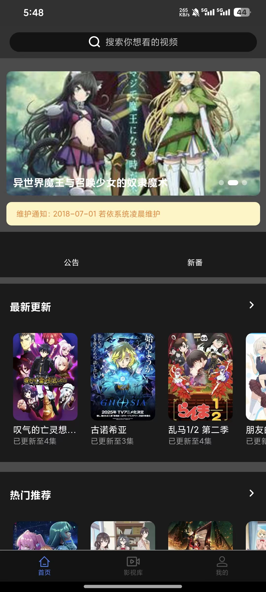
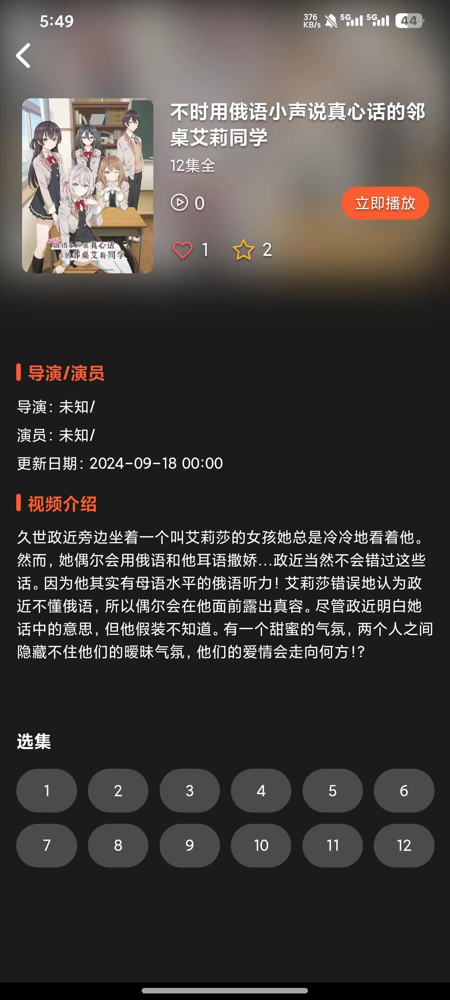
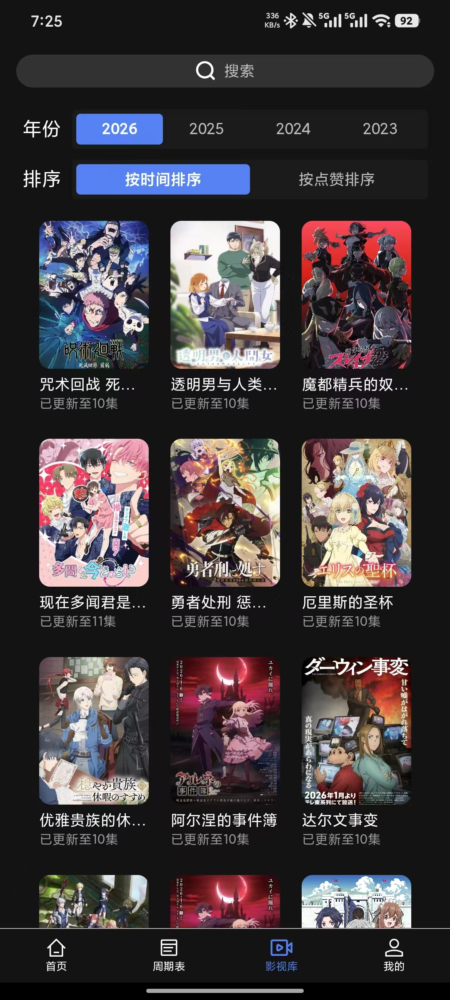
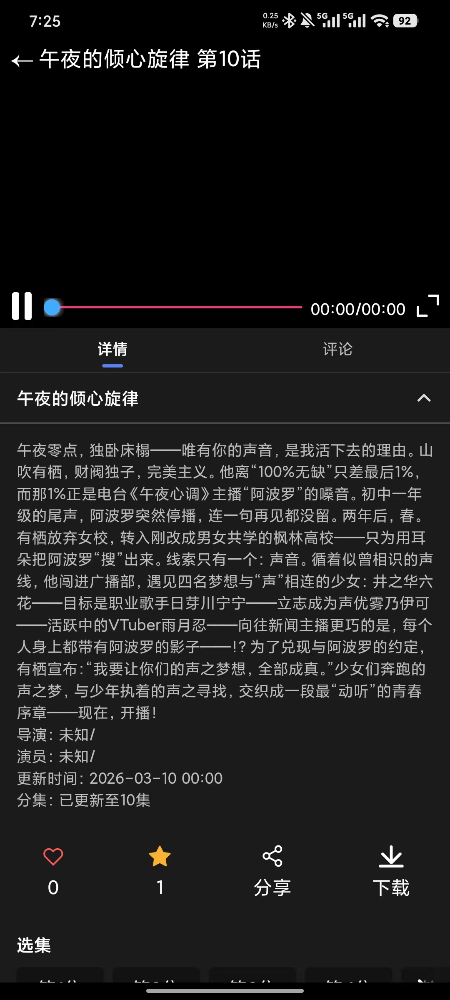

# 📺 CoolVideo（库视频）

[](LICENSE)
[](#)
[](#)
[](#)
[](#)

> 🎬 一款基于 **RuoYi 框架** 构建的视频内容管理系统（Video CMS），支持插件扩展与 App 管理。

---

## 🌈 项目简介

**CoolVideo（库视频）** 是一个功能完善的视频 CMS 系统，提供内容管理、视频解析、插件扩展、自动更新、App 管理等功能。  
系统基于 **Spring Boot + RuoYi + Vue3 + UniApp** 技术栈开发，旨在为影视站点及视频应用提供完整的后台与移动端解决方案。

---

## 📱 App 预览图

<div align="center">
  
  
  
  
</div>

---

## ✨ 功能特性

### 🔧 核心功能
- ✅ 支持常见的视频内容管理（分类、标签、推荐等）
- 🔌 插件式架构，支持自定义功能模块扩展
- ⚙️ 插件可解析第三方网站视频链接
- 🔁 自动更新系统，支持从外部 API（如 [弹弹Play](https://www.dandanplay.com/)）获取视频周更信息
- 🧩 支持视频内容自动化维护与批量更新

### 🌟 高级功能
- 📅 **视频周期表**：后台可编辑或插件自动同步
- ❤️ **用户系统**：历史记录、点赞、收藏等
- 📧 **邮箱注册与登录**
- 🔐 **安全系统**：防 XSS、防重复提交、防垃圾评论
- 💬 **评论管理**：支持关键词屏蔽、用户禁评、视频禁评
- ☁️ **Oss 与多源解析支持**：可递归解析视频地址，选择插件或存储源解析

---

## 🖥️ 服务端部署

### 环境要求
- JDK 17+
- Redis 8+
- MySQL 8.0+
- Minio (可选)
- Node.js（前端构建所需）

### 启动步骤
1. 上传编译后的 `jar` 文件至服务器
2. 执行启动命令：
   ```bash
   java -jar ruoyi-admin.jar
   ```
3. 访问后台管理端：  
   `http://<your-server-ip>:8080`
4. 默认管理员账号：  
   用户名：`admin`  
   密码：`admin123`

### 前端构建
- 前端项目位于 `ruoyi-ui`
- 使用 Vue3 + Element Plus
- 执行以下命令构建：
  ```bash
  npm install
  npm run build:prod
  ```
- 使用 Nginx 或其他静态服务器部署静态文件

---

## 🧩 插件系统

- 插件可在“系统管理 → 插件管理”中进行安装与启用
- 支持文件上传插件方式安装
- 插件市场与 API 文档正在开发中

---

## 📲 App 客户端

### 技术栈
- UniApp + Vue3 + JavaScript
- UI 组件库：[Wot Design Uni](https://wot-ui.cn/)

### 设置服务器地址
1. 下载发布版 APK
2. 打开 App，在搜索栏输入 `devTool`
3. 进入开发者调试页面，配置服务器地址（必须以 `http://` 或 `https://` 开头）

### 自行编译安装
请参考官方文档：  
👉 [UniApp 多平台打包指南](https://uniapp.dcloud.net.cn/tutorial/build/SafePack.html)

---

## 🧱 系统架构

```
CoolVideo
├── ruoyi-video-manager        # 管理平台API接口服务
├── ruoyi-video      # App端API接口服务
├── ruoyi-ui           # 管理后台（Vue3 + Element Plus）
├── ruoyi-mobile      # 移动端（UniApp）
└── plugins/           # 插件目录（可热插拔）
```

---

## 📄 开源协议

本项目采用 **GPL-3.0 License** 协议开源。


---

## 🤝 贡献指南

欢迎贡献代码、文档或插件：

- 🐞 提交 Issue 报告问题
- 💡 提交 Pull Request 提供改进
- 🔌 编写并共享插件
- 🌍 帮助完善国际化支持

---

## 📬 联系方式

如有问题或建议，请提交 Issue 或联系作者。

---

**CoolVideo — 打造智能的视频内容管理体验。 🎥**
